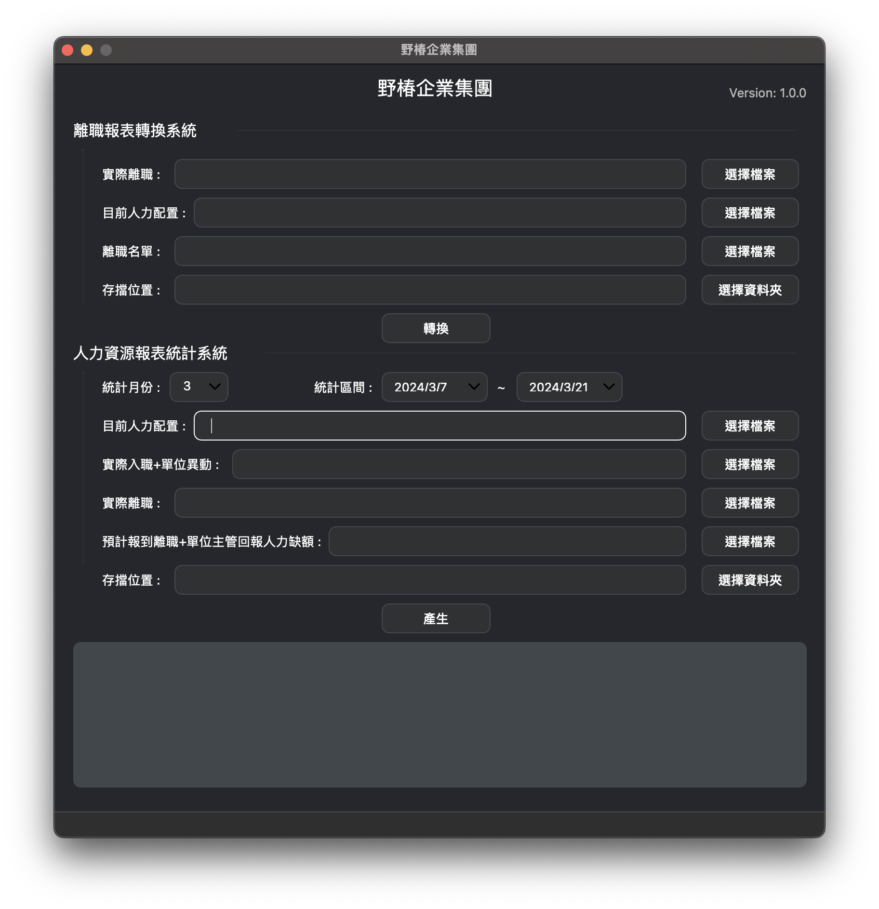
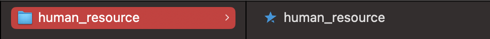
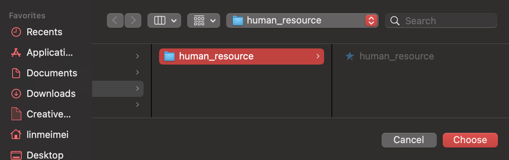
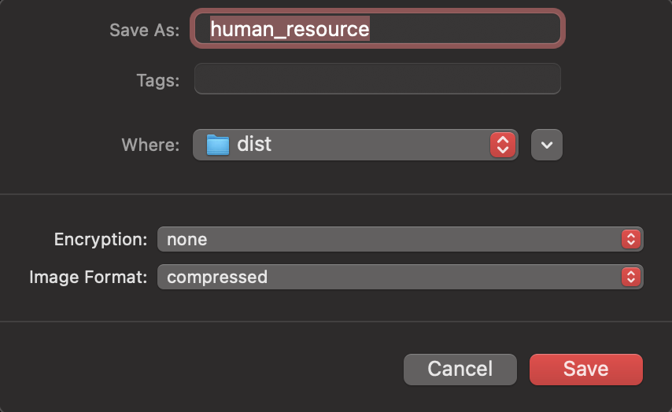
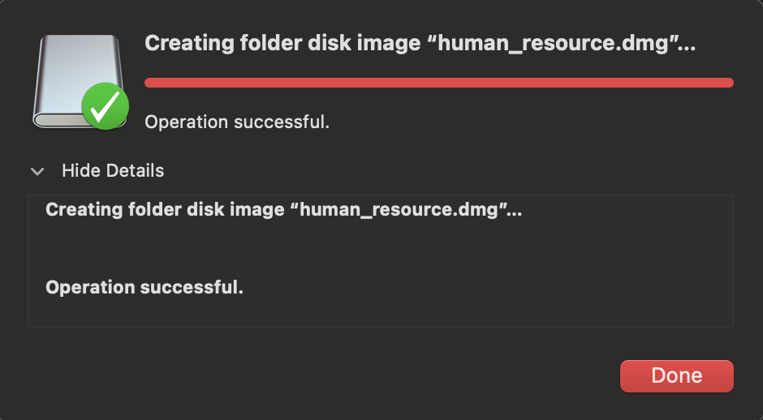

# Miopane

<div>
    
    <span style="font-size: 20px;vertical-align:middle;">Human Resource</span>
</div>

<!------------------------------------->
<!-------      ‍🔥 Top News      ------->
<!------------------------------------->
## <div align="center">🔥 Top News</div>

`2024-03-21` : Release v1.0.0


<!------------------------------------->
<!-------    📷 Screenshot      ------->
<!------------------------------------->
&emsp;
## <div align="center">📷 Screenshot</div>
<div align="center">
    
</div>


<!------------------------------------->
<!-------    🛠 How To Build    ------->
<!------------------------------------->
&emsp;
## <div align="center">🛠 How To Build</div> 
### macOS
・Build application (.app)
```
python setup.py py2app -A
```

・application(.app) convert to .dmg  
Create a new folder on Mac and copy .app file to the new folder  


Open Disk Utility > File > New Image > Image from Folder  


Choose the folder that is just created  


Save  


Finish  


&emsp;
### Windows
Open `auto-py-to-exe`
```
auto-py-to-exe
```